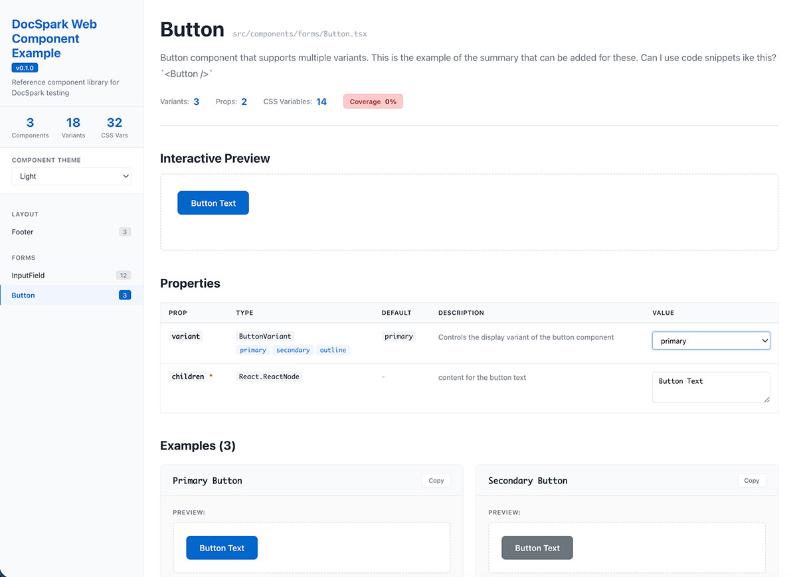

# DocSpark

**Simple, automatic component documentation for React built off your Typescript Definitions**

DocSpark automatically generates beautiful, interactive, documentation for your React components. Just add a simple config file and a few JSDoc tags, then generate a complete documentation site—no story files, no complex setup required.



🚀 **Simpler than Storybook** • 📦 **Works with existing components** • ⚡ **Minimal configuration**

---

## Features

✨ **Automatic Variant Generation** - Generates all component variants from TypeScript types

📝 **JSDoc Integration** - Uses your existing comments and type definitions

🎨 **Theme Token Support** - Extracts and documents CSS variables

🔍 **Live Component Previews** - Interactive component showcase

📊 **Test Coverage** - Optional Jest coverage integration

🎯 **Static Site Output** - Deploy anywhere (GitHub Pages, Netlify, Vercel)

⚡ **Fast** - Pre-built templates mean instant builds

---

## Quick Start

### 1. Create Configuration

Create `docspark.config.json` in your project root:

```json
{
  "name": "My Component Library",
  "description": "Beautiful React components",
  "version": "1.0.0",
  "source": {
    "include": ["src/components/**/*.{tsx,jsx}"]
  },
  "output": {
    "directory": "./docs"
  }
}
```

### 2. Add JSDoc Tags

Add the `@renderVariants` JSDoc tag to props you want to document:

```typescript
export interface ButtonProps {
  /**
   * Visual style of the button
   * @renderVariants true
   * @displayTemplate {variant} Button
   */
  variant?: 'primary' | 'secondary' | 'outline';
}
```

### 3. Generate Documentation

```bash
npx docspark@latest build
```

DocSpark will:
1. Parse your TypeScript components and JSDoc tags
2. Generate all component variants automatically
3. Create a complete static website in `./docs`
4. Ready to deploy or preview locally

### Preview Locally

```bash
npx docspark serve
```

Open http://localhost:8080 to view your documentation.

---

## Configuration

Create `docspark.config.json` in your project root:

```json
{
  "name": "My Component Library",
  "description": "Beautiful React components",
  "version": "1.0.0",

  "source": {
    "include": ["src/components/**/*.{tsx,jsx}"]
  },

  "output": {
    "directory": "./docs"
  }
}
```

### Full Configuration Options

```json
{
  "name": "My Component Library",
  "description": "Beautiful, accessible React components",
  "version": "1.0.0",

  "source": {
    "include": [
      "src/components/**/*.{tsx,jsx}"
    ],
    "exclude": [
      "**/*.test.{tsx,jsx}",
      "**/*.stories.{tsx,jsx}"
    ],
    "styleFiles": [".css", ".scss", ".module.css", ".module.scss"]
  },

  "output": {
    "directory": "./docs",
    "baseUrl": "/"
  },

  "server": {
    "port": 8080
  },

  "variants": {
    "autoGenerate": true,
    "maxPermutations": 20,
    "defaultValues": {
      "string": "Example text",
      "number": 42,
      "children": "Button Text"
    }
  },

  "theme": {
    "tokens": [
      {
        "Light": {
          "source": "src/themes/light.css",
          "background": "#FFFFFF"
        }
      },
      {
        "Dark": {
          "source": "src/themes/dark.css",
          "background": "#000000"
        }
      }
    ],
    "defaultTheme": "Light",
    "primaryColor": "#0066cc"
  },

  "coverage": {
    "enabled": true,
    "coverageDirectory": "./coverage",
    "threshold": {
      "statements": 80,
      "branches": 80,
      "functions": 80,
      "lines": 80
    }
  },

  "features": {
    "search": true,
    "darkMode": true,
    "codeSnippets": true,
    "playground": false,
    "testCoverage": true
  }
}
```

---

## Writing Documentable Components

DocSpark works with your existing TypeScript components. Use JSDoc tags to control documentation behavior:

### Basic Component

```typescript
// src/components/Button.tsx
import React from 'react';
import styles from './Button.module.scss';

export type ButtonVariant = 'primary' | 'secondary' | 'outline';

export interface ButtonProps {
  /**
   * Controls the visual style of the button
   * @renderVariants true
   * @displayTemplate {variant} Button
   */
  variant?: ButtonVariant;

  /** Button label text */
  children: React.ReactNode;
}

/**
 * Button component that supports multiple variants
 */
const Button: React.FC<ButtonProps> = ({
  variant = 'primary',
  children
}) => {
  return <button className={styles[variant]}>{children}</button>;
};

export default Button;
```

**Result**: DocSpark generates 3 variants with titles "Primary Button", "Secondary Button", "Outline Button"

### JSDoc Tags

DocSpark uses industry-standard JSDoc tags to control documentation generation:

#### `@renderVariants`
Generate all variants for this prop:
```typescript
/**
 * Size of the button
 * @renderVariants true
 */
size?: 'small' | 'medium' | 'large';
```

#### `@displayTemplate`
Customize variant titles:
```typescript
/**
 * @renderVariants true
 * @displayTemplate {size} {variant} Button
 */
size?: 'small' | 'medium' | 'large';
```

Generates titles like "Small Primary Button", "Large Secondary Button"

#### `@hideInDocs`
Hide internal props:
```typescript
/**
 * Internal test ID
 * @hideInDocs
 */
_testId?: string;
```

#### `@example`
Override default values:
```typescript
/**
 * Button label
 * @example "Click Me!"
 */
label?: string;
```

### CSS Variables

Document theme tokens in your stylesheets:

```scss
// Button.module.scss

/**
 * CSS Variables:
 * --button-primary-bg: Primary button background color
 * --button-primary-text: Primary button text color
 * --button-border-radius: Button corner radius
 */

.button {
  padding: 0.75rem 1.5rem;
  border-radius: var(--button-border-radius, 0.375rem);
}

.primary {
  background-color: var(--button-primary-bg, #0066cc);
  color: var(--button-primary-text, #ffffff);
}
```

---

## CLI Commands

### `build`

Generate static documentation site:

```bash
npx docspark build [options]
```

**Options:**
- `-c, --config <path>` - Config file path (default: `./docspark.config.json`)
- `--base-url <url>` - Base URL for deployment (default: `/`)
- `--clean` - Clean output directory first
- `--verbose` - Detailed build output

**Examples:**
```bash
# Basic build
npx docspark build

# Custom config and base URL
npx docspark build --config ./config/docs.json --base-url /components/

# Verbose output with clean
npx docspark build --verbose --clean
```

**Output:**
```
./docs/
├── index.html                 # Documentation website
├── static/
│   ├── js/                    # React app bundle
│   └── css/                   # Styles
├── metadata/
│   ├── index.json             # Component index
│   ├── Button.json            # Component metadata
│   └── InputField.json        # More components
└── themes/
    ├── light.css              # Theme tokens
    └── dark.css
```

### `serve`

Preview documentation locally:

```bash
npx docspark serve [options]
```

**Options:**
- `-p, --port <port>` - Server port (default: `8080`)
- `-d, --dir <directory>` - Docs directory (default: `./docs`)

**Example:**
```bash
# Serve on default port
npx docspark serve

# Custom port
npx docspark serve --port 3000
```

### `dev`

Development mode with file watching:

```bash
npx docspark dev [options]
```

**Options:**
- `-p, --port <port>` - Server port (default: `6006`)
- `-c, --config <path>` - Config file path

Watches source files and rebuilds on changes.

---

## Deployment

DocSpark generates a static site that can be deployed anywhere:

### GitHub Pages

```yaml
# .github/workflows/deploy-docs.yml
name: Deploy Documentation

on:
  push:
    branches: [main]

jobs:
  deploy:
    runs-on: ubuntu-latest
    steps:
      - uses: actions/checkout@v3

      - name: Setup Node
        uses: actions/setup-node@v3
        with:
          node-version: '18'

      - name: Install dependencies
        run: npm install

      - name: Build documentation
        run: npx docspark build --base-url /my-repo/

      - name: Deploy to GitHub Pages
        uses: peaceiris/actions-gh-pages@v3
        with:
          github_token: ${{ secrets.GITHUB_TOKEN }}
          publish_dir: ./docs
```

### Netlify

```toml
# netlify.toml
[build]
  command = "npx docspark build"
  publish = "docs"
```

### Vercel

```json
{
  "buildCommand": "npx docspark build",
  "outputDirectory": "docs"
}
```

---

## Package.json Scripts

Add to your `package.json`:

```json
{
  "scripts": {
    "docs:build": "docspark build --verbose",
    "docs:serve": "docspark serve",
    "docs:dev": "docspark dev"
  }
}
```

Then run:
```bash
npm run docs:build
npm run docs:serve
```

---

## Example Output

Running `npx docspark build`:

```
📦 Building documentation...

✅ Configuration validated successfully

📖 Project: My Component Library
📂 Source: src/components/**/*.{tsx,jsx}
📁 Output: ./docs
🔗 Base URL: /

🎨 Loading 2 theme(s)...
  ✓ Loaded "Light" theme with 40 tokens (bg: #FFFFFF)
  ✓ Loaded "Dark" theme with 4 tokens (bg: #000000)

🔍 Scanning for components...
📄 Found 5 files

📝 Parsing src/components/Button.tsx...
  🎨 Found 14 CSS variables
  ✨ Generated 3 variants
  📊 Coverage: 95.2%

📝 Parsing src/components/Input.tsx...
  🎨 Found 18 CSS variables
  ✨ Generated 12 variants
  📊 Coverage: 87.4%

📋 Copying website template...

✅ Build complete!
📄 Generated 5 component pages
📊 Total variants: 27
🎨 CSS variables: 65

📂 Output: /path/to/your/project/docs
💡 Run "docspark serve" to preview your documentation
```

---

## Why DocSpark?

### vs Storybook

| Feature | DocSpark | Storybook |
|---------|-----------|-----------|
| Setup time | 2-5 minutes (simple config) | 15-30 minutes |
| Story files | Not needed | Required for every component |
| Build time | ~2 seconds | ~30+ seconds |
| Output | Static HTML (deploy anywhere) | Requires server |
| Variant generation | Automatic from types + JSDoc tags | Manual stories |
| Theme tokens | Built-in support | Requires addons |
| Learning curve | Minimal (JSDoc tags) | Steep |

### vs React Docgen

| Feature | DocSpark | React Docgen |
|---------|-----------|--------------|
| Complete site | ✅ Ready to deploy | ❌ Just JSON |
| UI | ✅ Beautiful React app | ❌ DIY |
| Variants | ✅ Auto-generated | ❌ Manual |
| CSS variables | ✅ Extracted | ❌ Not supported |
| Live preview | ✅ Built-in | ❌ DIY |

---

## Requirements

- Node.js 16+
- TypeScript project with React components
- Components using TypeScript interfaces for props

---

## Troubleshooting

### Components not found

**Problem**: "No components found" error

**Solution**:
- Verify components are in paths matching `source.include` patterns
- Ensure components export a `ComponentNameProps` interface
- Check that files use `.tsx` or `.jsx` extension

### CSS variables not extracted

**Problem**: CSS variables not showing in docs

**Solution**:
- Document variables in comments: `* --var-name: Description`
- Use `var(--var-name, fallback)` syntax for defaults
- Ensure style files match `styleFiles` extensions in config

### Build fails with TypeScript errors

**Problem**: TypeScript compilation errors

**Solution**:
- Ensure TypeScript 5.x is installed
- Check `tsconfig.json` is present in project root
- Verify component prop interfaces are properly typed

---

## Contributing

Contributions welcome! See the [GitHub repository](https://github.com/yourusername/docspark) for details.

---

## License

MIT © 2024

---

## Support

- 📖 [Documentation](https://github.com/inkorange/docspark)
- 🐛 [Report Issues](https://github.com/inkorange/docspark/issues)
- 💬 [Discussions](https://github.com/inkorange/docspark/discussions)
